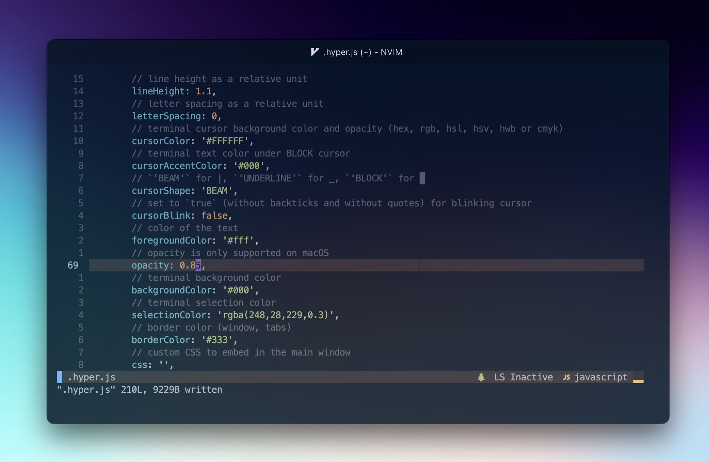

<h1 align="center">Enzo Mourany's Dotfiles</h1>
<p>
</p>

[Hyper](#hyper)

[Shell](#shell-setup)

<br />

# Shell setup

## Install brew (macos)

```
/bin/bash -c "$(curl -fsSL https://raw.githubusercontent.com/Homebrew/install/HEAD/install.sh)"
```

## Install fish

```
brew install fish
```

## Install fisher

```
brew install fisher
```

## Install iTerm

If you are using basic terminal on your mac you should install iTerm which is better built and looks better

```
brew install --cask iterm2
```

# Hyper


## Install (brew)

```sh
brew install --cask hyper
```

## Install Hyper Command (zsh)

```sh
sudo ln -s &#34;/Applications/Hyper.app/Contents/Resources/bin/hyper&#34; /usr/local/bin/hyper
```

## Change font family

```
code ~/.hyper.js
```

or

```
vim ~/.hyper.js
```

Use this parameter


<br/>

## Night Owl Theme

```
hyper i hyper-night-owl
```

## Install Fig (brew)


```sh
brew install --cask fig
```

Setup Fig

Restart Hyper

<br />

## Set low opacity



```
hyper i hyper-opacity
```

Change opacity in .hyper.js


<br/>

## Install Plugins

Go to this [link](https://github.com/bnb/awesome-hyper.git) to see and install some plugins

<br />

## Author

👤 **Enzo Mourany**

* Website: enzomourany.com
* Github: [@enzo-mourany](https://github.com/enzo-mourany)

## Show your support

Give a ⭐️ if this project helped you!

