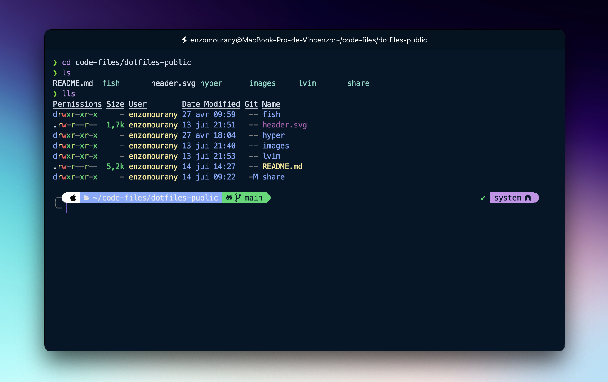

<h1 align="center">Enzo Mourany's Dotfiles</h1>
<p>
</p>

[Shell](#shell-setup)

[VSCode Terminal](#vscode-terminal)

[Hyper](#hyper)

[Nvim](#nvim)

<br />

# Shell setup

## Install brew (macos)

```sh
/bin/bash -c "$(curl -fsSL https://raw.githubusercontent.com/Homebrew/install/HEAD/install.sh)"
```

## Install fish

```sh
brew install fish
```

## Install fisher

```sh
brew install fisher
```

## Install iTerm

If you are using basic terminal on your mac you should install iTerm which is better built and looks better

```sh
brew install --cask iterm2
```

## Install oh-my-zsh

To get this render


```sh
sh -c "$(curl -fsSL https://raw.githubusercontent.com/robbyrussell/oh-my-zsh/master/tools/install.sh)"
```

## Install powerlevel10k

Clone this repository to use powerlevel10k and get a better render. If git is not already installed, go to this [page](https://github.com/git-guides/install-git)

```sh
git clone https://github.com/romkatv/powerlevel10k.git $ZSH_CUSTOM/themes/powerlevel10k
```

Now open `~/.zshrc` and set `ZSH_THEME="powerlevel10k/`powerlevel10k"`

Quit iTerm and relaunch it

A special page will appear and you will have to select proposals to configure powerlevel10k

More info on [powerlevel10k](https://github.com/romkatv/powerlevel10k) github page

Finally quit et relaunch iTerm again and see the result

If you want to edit the configuration :

```sh
p10k configure
```

You can also edit the code on `~/.p10k.zsh`

## Install Plugins

### Syntax Highlighting

```sh
brew install zsh-syntax-highlighting
```

Enable the syntax highlighting :

```sh
source ./zsh-syntax-highlighting/zsh-syntax-highlighting.zsh
```

# VSCode Terminal

After configuring oh-my-zsh, VSCode's terminal does not support powerlevel10k icons. So you have to go to vscode settings

Go to `Settings` and search `terminal font` and change the value to `MesloLGS NF`


# Hyper




## Install (brew)

```sh
brew install --cask hyper
```

## Install Hyper Command (zsh)

```sh
sudo ln -s &#34;/Applications/Hyper.app/Contents/Resources/bin/hyper&#34; /usr/local/bin/hyper
```

## Change font family

```sh
code ~/.hyper.js
```

or

```sh
vim ~/.hyper.js
```

Use this parameter


<br/>

## Night Owl Theme

```sh
hyper i hyper-night-owl
```

## Install Fig (brew)


```sh
brew install --cask fig
```

Setup Fig

Restart Hyper

<br />

## Set low opacity


```sh
hyper i hyper-opacity
```

Change opacity in .hyper.js


<br/>

## Install Plugins

Go to this [link](https://github.com/bnb/awesome-hyper.git) to see and install some plugins

<br />

# NeoVim

## Installation

```
brew install neovim
```

# 

## Author

👤 **Enzo Mourany**

* Website: enzomourany.com
* Github: [@enzo-mourany](https://github.com/enzo-mourany)

## Show your support

Give a ⭐️ if this project helped you!

