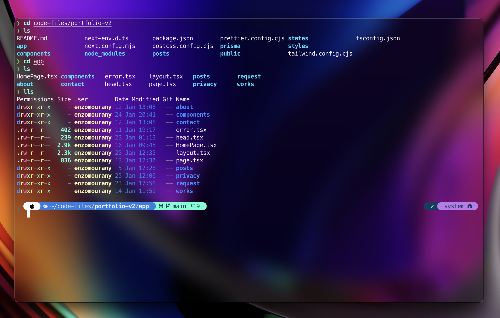

<div align="center">

  [![Contributors][contributors-shield]][contributors-url]
  [![Forks][forks-shield]][forks-url]
  [![Stargazers][stars-shield]][stars-url]
  [![Issues][issues-shield]][issues-url]

</div>

<h1 align="center">

</h1>


<!-- TABLE OF CONTENTS -->
<details>
  <summary>Table of Contents</summary>
  <ol>
    <li>
      <a href="#about-the-project">About</a>
      <ul>
        <li><a href="#built-with">Built With</a></li>
      </ul>
    </li>
    <li>
      <a href="#getting-started">Getting Started</a>
      <ul>
        <li><a href="#prerequisites">Homebrew</a></li>
        <li><a href="#installation">iTerm</a></li>
        <li><a href="#installation">oh-my-zsh</a></li>
        <li><a href="#installation">powerlevel10k</a></li>
        <li><a href="#installation">Plugins</a></li>
        <ul>
          <li><a href="#installation">Syntax Highlighting</a></li>
        </ul>
      </ul>
    </li>
    <li><a href="#usage">Usage</a></li>
    <li><a href="#roadmap">Roadmap</a></li>
    <li><a href="#contributing">Contributing</a></li>
    <li><a href="#license">License</a></li>
    <li><a href="#contact">Contact</a></li>
    <li><a href="#acknowledgments">Acknowledgments</a></li>
  </ol>
</details>


<!-- ABOUT THE PROJECT -->
## About



My personal configuration for my terminal, vim, vscode, etc... to be more productive

<br />


### Built With

* [![Shell][Shell]][Shell-url]
* [![Lua][Lua]][Lua-url]
* [![Vim][Vim]][Vim-url]

<p align="right">(<a href="#readme-top">back to top</a>)</p>


# Getting Started

## Install brew (macos)

[Brew](https://brew.sh/index_fr) is a package manager for macos

```sh
/bin/bash -c "$(curl -fsSL https://raw.githubusercontent.com/Homebrew/install/HEAD/install.sh)"
```

## Install iTerm

If you are using basic terminal on your mac you should install iTerm which is better built and looks better

```sh
brew install --cask iterm2
```

## Install oh-my-zsh

To get this render


```sh
sh -c "$(curl -fsSL https://raw.githubusercontent.com/robbyrussell/oh-my-zsh/master/tools/install.sh)"
```

## Install powerlevel10k

Clone this repository to use powerlevel10k and get a better render. If git is not already installed, go to this [page](https://github.com/git-guides/install-git)

```sh
git clone https://github.com/romkatv/powerlevel10k.git $ZSH_CUSTOM/themes/powerlevel10k
```

Now open `~/.zshrc` and set `ZSH_THEME="powerlevel10k/`powerlevel10k"`

Quit iTerm and relaunch it

A special page will appear and you will have to select proposals to configure powerlevel10k

More info on [powerlevel10k](https://github.com/romkatv/powerlevel10k) github page

Finally quit et relaunch iTerm again and see the result

If you want to edit the configuration :

```sh
p10k configure
```

You can also edit the code on `~/.p10k.zsh`

## Install Plugins

### Syntax Highlighting

```sh
brew install zsh-syntax-highlighting
```

Enable the syntax highlighting :

```sh
source ./zsh-syntax-highlighting/zsh-syntax-highlighting.zsh
```


# VSCode

## Install VSCode

```sh
brew install --cask visual-studio-code
```

## Setup VSCode Terminal

After configuring oh-my-zsh, VSCode's terminal does not support powerlevel10k icons. So you have to go to vscode settings

Go to `Settings` and search `terminal font` and change the value to `MesloLGS NF`


## Setup VSCode Settings

Go to `Settings` and search `settings.json`. Then copy the content of `vscode-settings.json` to your `settings.json`

```json
{
  "workbench.colorTheme": "Palenight Theme",
  "python.defaultInterpreterPath": "/opt/homebrew/bin/python3",
  "editor.suggestSelection": "first",
  "editor.wordWrap": "on",
  "files.exclude": {
    "**/.project": true,
    "**/.settings": true,
    "**/.classpath": true,
    "**/.factorypath": true
  },

  ... // go check vscode/settings.json

}
```

<a href="https://github.com/enzo-mourany/dotfiles/vscode/settings.json">settings.json</a>

# Hyper

- Hyper is a simple to use and efficient terminal coded in javascript. It's easy to configure it to make it use for any use


## Install (brew)

```sh
brew install --cask hyper
```

## Install Hyper Command (zsh)

```sh
sudo ln -s &#34;/Applications/Hyper.app/Contents/Resources/bin/hyper&#34; /usr/local/bin/hyper
```

## Change font family

```sh
code ~/.hyper.js
```

or

```sh
vim ~/.hyper.js
```

Change the value of `fontFamily`


<br/>

## Night Owl Theme

```sh
hyper i hyper-night-owl
```

## Install Fig (brew)


<br/>

```sh
brew install --cask fig
```

Setup Fig

Restart Hyper

<br />

## Set low opacity


<br/>

```sh
hyper i hyper-opacity
```

Change the value of `opacity` which is default **1** to **0.85** for example

## Install Plugins

Go to this [link](https://github.com/bnb/awesome-hyper.git) to see and install some plugins

<br />


# NeoVim

## Installation

```
brew install neovim
```

To config Neovim you have to go to `~/.config/nvim` on MacOS

## LunarVim


<br />

For several months I used a Neovim config that I had created especially for web and mobile development. I recently switched to LunarVim which allows me to have additional features and better rendering

## Prerequisites

- ### Install lua

```
brew install lua
```

- ### Install cargo

```
curl https://sh.rustup.rs -sSf | sh
```

## Installation (MacOS)

```
bash <(curl -s https://raw.githubusercontent.com/lunarvim/lunarvim/master/utils/installer/install.sh)
```

To config Neovim you have to go to `~/.config/lvim` and `~/.local/share/lunarvim` on MacOS

Edit `.zshrc` and add `PATH=$PATH:~/.local/bin`

Now enter `lvim`to open lunarVim

<br/>

- This is the render with javascriptreact file


<br/>

- To open the integral terminal on your lunarVim window, press `ctrl` + `t`


<br/>

- Lunar Vim uses telescope — a fuzzy file finder and pattern matching machine. Use it to open files by pressing `space` + `f`. You can also open this from the welcome screen


<br/>

- Pressing `g` while in normal mode will open up a different set of options which are incredibly useful. Go to definition, reference, and more!


<br/>

- To split window vertically, press `escape` and type `:vsplit`

- To split window horizontally, type `:split`


<br/>

- You can display the file explorer by typing `space` + `e`


<br />

## Author

👤 **Enzo Mourany**

- Website: enzomourany.com
- Github: [@enzo-mourany](https://github.com/enzo-mourany)

## Show your support

Give a ⭐️ if this project helped you!


[contributors-shield]: https://img.shields.io/github/contributors/enzo-mourany/dotfiles.svg?style=for-the-badge
[contributors-url]: https://github.com/enzo-mourany/dotfiles/graphs/contributors
[forks-shield]: https://img.shields.io/github/forks/enzo-mourany/dotfiles.svg?style=for-the-badge
[forks-url]: https://github.com/enzo-mourany/dotfiles/network/members
[stars-shield]: https://img.shields.io/github/stars/enzo-mourany/dotfiles.svg?style=for-the-badge
[stars-url]: https://github.com/enzo-mourany/dotfiles/stargazers
[issues-shield]: https://img.shields.io/github/issues/enzo-mourany/dotfiles.svg?style=for-the-badge
[issues-url]: https://github.com/enzo-mourany/dotfiles/issues


<!-- Build With URLs -->
[Shell]: https://img.shields.io/badge/Shell-010080?style=for-the-badge&logo=shell&logoColor=white
[Shell-url]: https://www.shell.com/
[Lua]: https://img.shields.io/badge/Lua-000000?style=for-the-badge&logo=lua&logoColor=white
[Lua-url]: https://www.lua.org/
[Vim]: https://img.shields.io/badge/Vim-049733?style=for-the-badge&logo=vim&logoColor=white
[Vim-url]: https://www.vim.org/